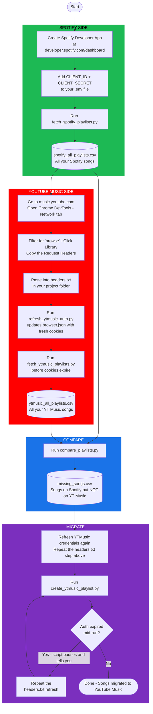

# Spotify to YouTube Music Migration Tool

Migrate your entire Spotify library — playlists, songs, everything — to YouTube Music using Python scripts. Built for people who are comfortable running a few terminal commands but don't need to be software engineers.

Migrated 1,000+ songs personally. The process involves a few manual steps (mainly refreshing YouTube Music browser credentials), but the scripts handle all the heavy lifting including auto-resuming if something breaks mid-way.

---

## Table of Contents
- [How It Works](#how-it-works)
- [Prerequisites](#prerequisites)
- [Project Structure](#project-structure)
- [Step-by-Step Guide](#step-by-step-guide)
  - [Step 1: Spotify Setup](#step-1-spotify-setup)
  - [Step 2: Fetch Your Spotify Playlists](#step-2-fetch-your-spotify-playlists)
  - [Step 3: YouTube Music Auth Setup](#step-3-youtube-music-auth-setup)
  - [Step 4: Fetch Your YouTube Music Playlists](#step-4-fetch-your-youtube-music-playlists)
  - [Step 5: Compare and Find Missing Songs](#step-5-compare-and-find-missing-songs)
  - [Step 6: Migrate to YouTube Music](#step-6-migrate-to-youtube-music)
- [Sample Output Files](#sample-output-files)
- [Alternative: GCP OAuth Approach](#alternative-gcp-oauth-approach-advanced)
- [Troubleshooting](#troubleshooting)

---

## How It Works



---

## Prerequisites

Before you start, make sure you have:

- **Python 3.9+** — check with `python3 --version` in your terminal. Download from [python.org](https://www.python.org/downloads/) if needed.
- **pip** — usually comes with Python. Check with `pip --version`.
- **Google Chrome** — needed for the YouTube Music auth step.
- A Spotify account with playlists you want to migrate.
- A YouTube Music account (must have visited [music.youtube.com](https://music.youtube.com) at least once).

---

## Project Structure

```
songs_migrate/
│
├── .env                          ← your credentials (never shared, git-ignored)
├── .env.example                  ← template — copy this and fill in your creds
├── browser.json.example          ← shows the structure of the YT Music auth file
│
├── fetch_spotify_playlists.py    ← Step 2: exports all Spotify songs to CSV
├── fetch_ytmusic_playlists.py    ← Step 4: exports all YT Music songs to CSV
├── compare_playlists.py          ← Step 5: finds songs missing from YT Music
├── create_ytmusic_playlist.py    ← Step 6: imports missing songs into YT Music
│
├── refresh_ytmusic_auth.py       ← updates browser.json from headers.txt
├── setup_oauth.py                ← alternative auth: GCP OAuth flow (see below)
├── test_ytmusic_auth.py          ← quick check to confirm YT Music auth is working
│
├── requirements.txt              ← Python libraries needed
│
├── headers.txt                   ← your browser headers (git-ignored, you create this)
├── browser.json                  ← your YT Music session (git-ignored, auto-generated)
├── oauth.json                    ← your OAuth tokens (git-ignored, auto-generated)
│
├── sample_spotify_playlists.csv  ← example of Spotify export format
├── sample_ytmusic_playlists.csv  ← example of YT Music export format
└── sample_missing_songs.csv      ← example of comparison output format
```

---

## Step-by-Step Guide

### Initial Setup (do this once)

```bash
# 1. Clone this repo
git clone https://github.com/YOUR-USERNAME/songs-migrate.git
cd songs-migrate

# 2. Create a virtual environment (keeps dependencies isolated)
python3 -m venv venv

# 3. Activate it
source venv/bin/activate        # Mac/Linux
# venv\Scripts\activate         # Windows

# 4. Install dependencies
pip install -r requirements.txt

# 5. Create your .env file from the template
cp .env.example .env
# Open .env in any text editor and fill in your credentials (steps below)
```

---

### Step 1: Spotify Setup

You need a Spotify Developer App to access your playlists via their API. It's free and takes about 5 minutes.

1. Go to [developer.spotify.com/dashboard](https://developer.spotify.com/dashboard) and log in with your Spotify account
2. Click **Create app**
3. Fill in any name and description (e.g. "My Migration Tool")
4. In the **Redirect URIs** field, add exactly: `http://127.0.0.1:8888/callback`
5. Check **Web API** under APIs used, then click **Save**
6. On your app's page, click **Settings** — you'll see your **Client ID** and **Client Secret**
7. Open your `.env` file and fill them in:

```env
SPOTIFY_CLIENT_ID=paste_your_client_id_here
SPOTIFY_CLIENT_SECRET=paste_your_client_secret_here
SPOTIFY_REDIRECT_URI=http://127.0.0.1:8888/callback
```

---

### Step 2: Fetch Your Spotify Playlists

```bash
python3 fetch_spotify_playlists.py
```

A browser window will open asking you to log in to Spotify and grant access — click Agree. The script fetches every playlist and every song in your library and saves everything to `spotify_all_playlists.csv`. You only need to do this once.

---

### Step 3: YouTube Music Auth Setup

This is the trickiest part. YouTube Music doesn't have a simple public API, so we authenticate by borrowing your browser's active session cookies. These cookies expire every few minutes, so you'll repeat this step a couple of times throughout the process.

1. Open Google Chrome and go to [music.youtube.com](https://music.youtube.com)
2. Make sure you're logged into the YouTube account you want to migrate to
3. Open DevTools — press `F12` on Windows or `Cmd + Option + I` on Mac
4. Click the **Network** tab
5. Click the clear button (circle with a line through it) to wipe existing requests
6. In the filter box, type `browse`
7. In the YouTube Music page, click **Library** in the left sidebar
8. You should see a request appear in the Network tab — click the first one
9. Scroll down on the right panel until you see **Request Headers**
10. Right-click anywhere in that section and copy all the headers
11. Create a file called `headers.txt` in your project folder and paste everything in
12. Save the file

Now run:
```bash
python3 refresh_ytmusic_auth.py
```

This reads `headers.txt` and updates `browser.json` with your fresh session credentials. Move on to the next step quickly — the cookies expire in a few minutes.

---

### Step 4: Fetch Your YouTube Music Playlists

Immediately after Step 3, run:

```bash
python3 fetch_ytmusic_playlists.py
```

This fetches all songs currently in your YouTube Music library and saves them to `ytmusic_all_playlists.csv`.

---

### Step 5: Compare and Find Missing Songs

```bash
python3 compare_playlists.py
```

This compares your Spotify CSV against your YouTube Music CSV and generates `missing_songs.csv` — the list of songs that are on Spotify but not yet on YouTube Music. This is what gets imported in the next step.

---

### Step 6: Migrate to YouTube Music

First, refresh your YouTube Music credentials again (repeat Step 3 — copy headers from DevTools into `headers.txt` and run `refresh_ytmusic_auth.py`).

Then run:

```bash
python3 create_ytmusic_playlist.py
```

The script searches for each missing song on YouTube Music and adds it to your library. It saves progress as it goes, so if it stops, it picks up from where it left off.

For large libraries (500+ songs), the cookies will expire mid-run. The script detects this and pauses with a message asking you to refresh credentials. Just repeat the headers step, run `refresh_ytmusic_auth.py`, then restart the script — it won't re-import songs already done.

Personal note: migrating 1,000+ songs required refreshing credentials about 3 times. Each run got a few hundred songs through before the session expired. The resume feature meant nothing was lost.

---

## Sample Output Files

To understand the format of each CSV before running anything, check the included samples:

| File | What it shows |
|------|--------------|
| `sample_spotify_playlists.csv` | Format of Spotify export (100 songs) |
| `sample_ytmusic_playlists.csv` | Format of YT Music export (50 songs) |
| `sample_missing_songs.csv` | Format of the differential/missing list (50 songs) |

---

## Alternative: GCP OAuth Approach (Advanced)

**Disclaimer:** I attempted this approach to avoid the repeated browser-cookie refresh, but ran into persistent issues — token errors, scope mismatches, API quirks. I'm documenting it here in case you want to try. It should work in theory and would give you a token that doesn't expire every few minutes, but I couldn't get it to a stable state.

Instead of copying browser cookies, you can create proper OAuth 2.0 credentials through Google Cloud Platform. The `setup_oauth.py` script implements this using the TV Device Flow, which doesn't require a redirect URL and is more stable than the standard web OAuth flow.

Steps:

1. Go to [console.cloud.google.com](https://console.cloud.google.com) and create a new project
2. In the left menu, go to **APIs & Services → Library**
3. Search for **YouTube Data API v3**, click it, then click **Enable**
4. Go to **APIs & Services → Credentials → Create Credentials → OAuth 2.0 Client ID**
5. For application type, choose **TV and Limited Input devices** — this is what enables the device flow
6. Copy the **Client ID** and **Client Secret**
7. Add them to your `.env`:

```env
GOOGLE_CLIENT_ID=your_google_client_id_here
GOOGLE_CLIENT_SECRET=your_google_client_secret_here
```

8. Run:

```bash
python3 setup_oauth.py
```

9. The script displays a URL and a short code. Open the URL in Chrome, enter the code, and approve access
10. If successful, it saves an `oauth.json` file with a long-lived token

If this works for you, you won't need to keep refreshing browser cookies — the scripts will use `oauth.json` automatically. Skip the `headers.txt` and `refresh_ytmusic_auth.py` steps entirely.

---

## Troubleshooting

**`ModuleNotFoundError: No module named 'dotenv'`**
```bash
pip install -r requirements.txt
```

**Spotify auth opens a browser but then shows an error page**

Make sure your `.env` has `SPOTIFY_REDIRECT_URI=http://127.0.0.1:8888/callback` and that exact URL is listed in your Spotify Developer Dashboard under the app's Redirect URIs.

**YouTube Music script says "authentication error" or "401"**

Your cookies have expired. Repeat Step 3 — go back to Chrome DevTools, copy fresh Request Headers into `headers.txt`, and run `refresh_ytmusic_auth.py` again.

**Script crashes halfway through migration**

Just refresh credentials and re-run `create_ytmusic_playlist.py`. It reads `import_progress.json` to know where it left off and skips already-imported songs.

**Song not found on YouTube Music**

Some songs genuinely don't exist on YouTube Music due to licensing or regional restrictions. These get logged to `not_found.csv` for reference.

---

## License

MIT — use it, modify it, share it freely.
